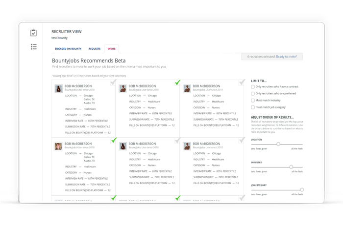

<!DOCTYPE html>
<html lang="en">

  <head>

    <meta charset="utf-8">
    <meta name="viewport" content="width=device-width, initial-scale=1, shrink-to-fit=no">
    <meta name="description" content="">
    <meta name="author" content="">

    <title>Senior UX/UI Designer Portfolio -- Scherry Sweeney</title>

    <!-- Bootstrap Core CSS -->
    <link href="vendor/bootstrap/css/bootstrap.min.css" rel="stylesheet">

    <!-- Custom Fonts -->
    <link href="vendor/fontawesome-free/css/all.min.css" rel="stylesheet" type="text/css">
    <link href="https://fonts.googleapis.com/css?family=Source+Sans+Pro:300,400,700,300italic,400italic,700italic" rel="stylesheet" type="text/css">
    <link href="vendor/simple-line-icons/css/simple-line-icons.css" rel="stylesheet">

    <!-- Custom CSS -->
    <link href="css/stylish-portfolio.min.css" rel="stylesheet">

  </head>

  <body id="page-top">

    <!-- Header -->
    <header class="masthead d-flex">
	  <nav class="navbar navbar-expand-md navbar-light bg-light fixed-top" style="border-bottom: thin solid #ddd;">
      
      <button class="navbar-toggler" type="button" data-toggle="collapse" data-target="#navbarsExampleDefault" aria-controls="navbarsExampleDefault" aria-expanded="false" aria-label="Toggle navigation">
        
      </button>

      

        <ul class="navbar-nav mr-auto">
          <li class="nav-item active">
            <a class="nav-link" href="#page-top">Home (current)</a>
          </li>
          <li class="nav-item">
            <a class="nav-link" href="#skills">Skills</a>
          </li>
          <li class="nav-item">
            <a class="nav-link" href="#portfolio">Portfolio</a>
          </li>
		  <li class="nav-item">
            <a class="nav-link" href="#contact">Contact</a>
          </li>
			<!--<li class="nav-item">
            <a class="nav-link disabled" href="#">Disabled</a>
          </li>-->
        </ul>
		  
		<ul class="list-inline my-2 my-lg-0 text-center">
		  <li class="list-inline-item">
            <a class="social-link rounded-circle text-white mr-3" href="img/resume2019.pdf" target="_blank">
              <i class="icon-doc"></i>
            </a>
          </li>	
          <li class="list-inline-item">
            <a class="social-link rounded-circle text-white mr-3" href="mailto:scherry.sweeney@gmail.com" target="_blank">
              <i class="icon-envelope"></i>
            </a>
          </li>
          <li class="list-inline-item">
            <a class="social-link rounded-circle text-white" href="https://www.linkedin.com/in/scherrysweeney/" target="_blank">
              <i class="icon-social-linkedin"></i>
            </a>
          </li>
        </ul>
      

    </nav>	
		
	<!-- Navigation 
    <a class="menu-toggle rounded" href="#">
      <i class="fas fa-bars"></i>
    </a>
    <nav id="sidebar-wrapper">
      <ul class="sidebar-nav">
        <li class="sidebar-brand">
          <a class="js-scroll-trigger" href="#page-top">Scherry Sweeney</a>
        </li>
        <li class="sidebar-nav-item">
          <a class="js-scroll-trigger" href="#page-top">Home</a>
        </li>
        <li class="sidebar-nav-item">
          <a class="js-scroll-trigger" href="#about">Skills &amp; Processes</a>
        </li>
        <li class="sidebar-nav-item">
          <a class="js-scroll-trigger" href="#portfolio">Portfolio</a>
        </li>
        <li class="sidebar-nav-item">
          <a class="js-scroll-trigger" href="#contact">Contact</a>
        </li>
      </ul>
    </nav>-->
		
      

        <!--<h1 class="mb-1">Scherry Sweeney's UX/UI Portfolio</h1>>
        <a class="btn btn-primary btn-med js-scroll-trigger" href="#skills" style="margin-bottom:-90px;">learn more</a>-->
      

      

    </header>

    <!-- About -->
    <section class="content-section bg-primary text-white text-center" id="skills">
      

        

          <h3 class="text-secondary mb-0">Skillz! I has them</h3>
          <h2 class="mb-5">UX Processes</h2>
        

        

          

            
              
            
            <h4>
              <strong>User Research</strong></h4>
            
Personas

			
Interviews &amp; surveys

			
Hueristic evaluation &amp; card sorting

			
User journeys &amp; empathy maps

			
          

          

            
              
            
            <h4>
              <strong>Architecture &amp; Design</strong></h4>
            
User flows

			
Wireframes

			
UI &amp; interaction design

			
High fidelity mockups

          

          

            
              
            
            <h4>
              <strong>Development</strong></h4>
            
Prototypes

			
UI specifications &amp; use cases

			
HTML5/CSS3/JavaScript

			
Agile dev environment

          

          

            
              
            
            <h4>
              <strong>Measure &amp; Iterate</strong></h4>
            
Analytics &amp; flight recorders

			
Usability testing

			
Monitor set key performance metrics

			
Champion iterative solutions

          

		  

		 	<a class="btn btn-light btn-med" href="skills.html">LEARN MORE</a>
		  

        

      

    </section>

    <!-- Portfolio -->
    <section class="content-section" id="portfolio">
      

        

          <h3 class="text-secondary mb-0">Portfolio</h3>
          <h2 class="text-primary mb-5">Recent Projects</h2>
        

        

			

            <a class="portfolio-item" href="portfolio-connect.html">
              
                
                  <h2>Building a new product line</h2>
                  
A streamlined recruitment platform for SMBs

                
              
              
            </a>
          

          

            <a class="portfolio-item" href="portfolio-partners.html">
              
                
                  <h2>Partner integrations</h2>
                  
Seamless integrations with ATS systems

                
              
              
            </a>
          

          

            <a class="portfolio-item" href="portfolio-employers.html">
              
                
                  <h2>Employer application</h2>
                  
Making vendor management a snap!

                
              
              
            </a>
          

          

            <a class="portfolio-item" href="portfolio-recruiters.html">
              
                
                  <h2>Recruiter application</h2>
                  
Job marketplace and collaboration platform

                
              
              
            </a>
          

		  <!--
          

            <a class="portfolio-item" href="portfolio-BJ-recommends.html">
              
                
                  <h2>Product Iteration</h2>
                  
Helping employers find the right recruiters

                
              
              
            </a>
          

          

            <a class="portfolio-item" href="portfolio-reports.html">
              
                
                  <h2>Product Feature</h2>
                  
Reports help employers manage performance

                
              
              
            </a>
          
-->
        

      

    </section>

    <footer class="footer bg-secondary text-center" id="contact">
      

        <ul class="list-inline mb-5">
		  <li class="list-inline-item">
            <a class="social-link rounded-circle text-white mr-3" href="img/resume2019.pdf" target="_blank">
              <i class="icon-doc"></i>
            </a>
          </li>	
          <li class="list-inline-item">
            <a class="social-link rounded-circle text-white mr-3" href="mailto:scherry.sweeney@gmail.com" target="_blank">
              <i class="icon-envelope"></i>
            </a>
          </li>
          <li class="list-inline-item">
            <a class="social-link rounded-circle text-white" href="https://www.linkedin.com/in/scherrysweeney/" target="_blank">
              <i class="icon-social-linkedin"></i>
            </a>
          </li>
        </ul>
        
Copyright &copy; www.scherrysweeney.com 2019

      

    </footer>

    <!-- Scroll to Top Button-->
    <a class="scroll-to-top rounded js-scroll-trigger" href="#page-top">
      <i class="fas fa-angle-up"></i>
    </a>

    <!-- Bootstrap core JavaScript -->
    
    

    <!-- Plugin JavaScript -->
    

    <!-- Custom scripts for this template -->
    

  </body>

</html>
